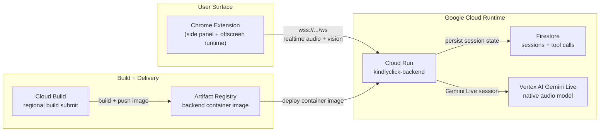

# KindlyClick

KindlyClick is a voice-first Chrome extension that helps seniors and other low-confidence computer users navigate websites in real time. The user opens the side panel, asks for help out loud, shares the current screen, and receives spoken guidance from an AI assistant that can also point to UI elements on the page.

This repository is a hackathon submission focused on live multimodal assistance: microphone input, screen understanding, streamed voice responses, and lightweight visual guidance.

## Why This App Exists

Many people struggle with modern web interfaces because they do not know:

- what on the page is important
- where to click next
- whether the page reacted correctly
- how to describe what they are seeing in technical terms

KindlyClick is designed to reduce that friction. Instead of requiring the user to read interface labels or understand browser conventions, the app behaves like a patient remote helper that can listen, look at the page, and guide the user step by step.

## What KindlyClick Does

- listens to the user through the microphone
- looks at the current shared tab or window
- streams both inputs to a live backend session
- replies with spoken guidance
- can visually highlight where to click on the page
- supports interruption so the user can speak over the assistant

## How To Use It

### User flow

1. Open the KindlyClick Chrome side panel.
2. Press `Call for help`.
3. Allow microphone access if prompted.
4. Share the current tab or window when prompted.
5. Ask for help naturally, for example:
   - "Where is the search bar?"
   - "How do I send this email?"
   - "What should I click next?"

The assistant will respond by voice and, when useful, highlight elements on the page.

### Current backend endpoint

The extension now defaults to the deployed backend:

```text
wss://kindlyclick-backend-cafvgv56ka-uc.a.run.app/ws
```

If your extension has an older saved backend URL in local storage, open the `Advanced` tab and update the `Backend WebSocket URL` field manually once.

### Manual extension setup

This project does not include Chrome Web Store publishing. To run it:

1. Open `chrome://extensions`
2. Enable `Developer mode`
3. Choose `Load unpacked`
4. Select the [extension](extension) folder
5. Open the KindlyClick side panel from the toolbar

## Architecture

Canonical Mermaid source: [docs/google-cloud-architecture.mmd](docs/google-cloud-architecture.mmd)



### Runtime architecture

- The Chrome extension provides the user interface, microphone capture, screen capture, playback, and page highlight overlay.
- An offscreen extension runtime owns the live session so the side panel is only a control surface.
- The backend is a Node.js WebSocket service deployed on Cloud Run.
- The backend streams audio and vision input into Gemini Live on Vertex AI.
- Session metadata and tool calls are persisted in Firestore.
- Cloud Build builds the container image and pushes it to Artifact Registry for Cloud Run deployment.

## Tech Stack

### Frontend and extension

- Chrome Extension Manifest V3
- JavaScript
- Web Audio API
- `getDisplayMedia` screen capture
- content scripts for on-page overlays

### Backend

- Node.js
- WebSocket server via `ws`
- Google GenAI SDK / Gemini Live integration
- Firestore client

### Google Cloud

- Cloud Run
- Vertex AI
- Firestore
- Artifact Registry
- Cloud Build
- IAM service accounts
- Terraform

## Repository Map

- [extension](extension): Chrome extension UI, offscreen runtime, background worker, and content scripts
- [backend](backend): WebSocket backend, Gemini session adapters, Firestore integration
- [terraform](terraform): infrastructure for Firestore, Artifact Registry, IAM, and Cloud Run
- [tests](tests): protocol and extension harnesses
- [scripts/deploy_backend.sh](scripts/deploy_backend.sh): backend deployment helper
- [TECHNICAL_OVERVIEW.md](TECHNICAL_OVERVIEW.md): deeper technical briefing
- [PRODUCT_SPEC.md](PRODUCT_SPEC.md): original product framing

## Local Development

### Backend in mock mode

```bash
cd backend
npm install
PORT=8091 npm start
```

### Backend with real Gemini Live

```bash
cd kindlyclick
set -a
source .env
set +a

export ENABLE_REAL_GEMINI_LIVE=true
export GOOGLE_CLOUD_PROJECT="$GCP_PROJECT_ID"
export GOOGLE_CLOUD_LOCATION="us-central1"
export GEMINI_LIVE_MODEL="gemini-live-2.5-flash-native-audio"
export GEMINI_LIVE_FALLBACK_MODELS="gemini-live-2.5-flash-preview-native-audio-09-2025,gemini-2.0-flash-live-preview-04-09"
export GEMINI_USE_VERTEXAI=true
export ACCEPT_CLIENT_LOGS=true

HOST=0.0.0.0 PORT=8091 npm --prefix backend start
```

### Harness tests

```bash
HARNESS_PORT=8092 node tests/harness.js
EXT_HARNESS_PORT=8093 node tests/extension_harness.js
node tests/runtime_protocol_harness.js
```

## Backend Deployment

The backend is deployed to Cloud Run. Chrome extension publishing is intentionally out of scope for this repo.

### One-command deploy

Prerequisites:

- `gcloud` authenticated to the target project
- `terraform` installed locally
- billing enabled on the GCP project
- `.env` contains `GCP_PROJECT_ID`

Run:

```bash
./scripts/deploy_backend.sh
```

The script:

- enables required Google Cloud APIs
- provisions Firestore, Artifact Registry, and IAM
- builds the container with Cloud Build
- deploys the backend to Cloud Run

### Manual deploy

```bash
cd terraform
terraform init
terraform apply \
  -var="project_id=YOUR_PROJECT_ID" \
  -var="region=us-central1" \
  -var="deploy_cloud_run_service=true" \
  -var="container_image=us-central1-docker.pkg.dev/YOUR_PROJECT_ID/kindlyclick/backend:TAG"
```

## Notable Hackathon Features

- Live multimodal interaction with audio and screen input
- Voice barge-in handling
- Help-first side panel UX
- Visual on-page highlight tool
- Cloud-native backend deployment
- Test harnesses for backend protocol and extension controller behavior

## Current Limitations

- The extension is loaded unpacked; Chrome Web Store distribution is not included.
- Page understanding is based on shared frames plus lightweight page metadata, not full DOM or accessibility-tree streaming.
- Persistence is intentionally minimal and focused on sessions and tool calls.
- The product is optimized for browser guidance, not arbitrary desktop automation.

## Submission Summary

KindlyClick turns a browser session into a live, assistive conversation. The user does not need to know what a button is called or how a site is structured. They ask for help naturally, the assistant sees the page, answers by voice, and can point directly at the right place on screen.
